# Third-Party Data Integrations Summary

Based on [lovable-data-integration-guide.md](lovable-data-integration-guide.md), here is how the dashboard is set up to receive and fetch data from external services.

---

## Data Flow Patterns

Three patterns power the dashboard:

| Pattern | Direction | Latency | Purpose |
|---------|-----------|---------|----------|
| **Push (Webhooks)** | External → Edge Function → DB → Frontend (Realtime) | <3 seconds | Real-time events: deal wins, Slack reactions, subscription activations |
| **Pull (On-Demand)** | Frontend → Edge Function → External API → Cache → Frontend | ~2–5 seconds | KPIs, GA4 active users, fun facts |
| **Sync (Batch)** | Edge Function → External API → DB | Minutes | Employee profiles, HubSpot owners, profile photos |

---

## 1. HubSpot Integration

**Auth:** Private App token (`HUBSPOT_ACCESS_TOKEN`), Bearer header, base URL `api.hubapi.com`

**Scopes:** `crm.objects.deals.read`, `crm.objects.custom.read`, `crm.objects.contacts.read`, `crm.objects.owners.read`, `crm.objects.companies.read`

### 1.1 `hubspot-deal-webhook` — Real-Time Celebrations (PUSH)

| Aspect | Details |
|--------|---------|
| **Input** | HubSpot Private App subscription (array) or Workflow POST (single object). Properties: `program_result_at`, `program_applied_at`, or `event_type`, `dealname`, `hubspot_owner_id`, `hs_acv`, etc. |
| **Output** | Inserts into `pending_celebrations` with `deal_id`, `deal_name`, `amount`, `company_name`, `owner_name`, `event_type`, etc. |
| **What is fetched** | Deal details via `GET /crm/v3/objects/deals/{id}`, owner names via `GET /crm/v3/owners/{id}` |
| **Purpose** | Drive real-time celebration popups when deals win, applications are submitted, quotes/renewals are signed, or PDMs/packages are paid |
| **Real-life use** | Grant consulting company: WIN when `program_result_at` changes; APPLICATION when `program_applied_at` changes; `quote_signed`, `renewal_signed`, `pdm_paid`, `pkg_paid` via HubSpot Workflows |

### 1.2 `hubspot-subscription-webhook` — SaaS Subscription Celebrations (PUSH)

| Aspect | Details |
|--------|---------|
| **Input** | `objectId` / `hs_object_id` of custom `_subscription` object (ID `2-42092209`) |
| **Output** | Inserts into `pending_celebrations` with `event_type: 'subscription'`, MRR, company name, PLG vs closer attribution |
| **What is fetched** | Subscription object, company via associations, closer owner |
| **Purpose** | Celebrate new SaaS trial conversions and activations |
| **Real-life use** | 7 validation checks (type=SaaS, status=Active, subscription_type=advanced, exclude demos/specific owner). PLG attribution when `metadata_closer_owner_id` is empty |

### 1.3 `hubspot-churn-webhook` — Churn Alerts (PUSH)

| Aspect | Details |
|--------|---------|
| **Input** | `objectId` / `subscriptionId` of canceled subscription |
| **Output** | Inserts into `pending_celebrations` with `event_type: 'subscription_churn'`, lost MRR. Logs to `webhook_logs` |
| **What is fetched** | Subscription, owner, company name |
| **Purpose** | Show churn alerts on the dashboard |

### 1.4 `hubspot-metrics` — Service Team Dashboard KPIs (PULL)

| Aspect | Details |
|--------|---------|
| **Input** | Frontend calls via `supabase.functions.invoke("hubspot-metrics")` with user auth |
| **Output** | `DashboardMetrics`: `acceptedThisQuarter`, `appliedThisQuarter`, `newClientsThisQuarter`, `activePlatformSubscribers`, `quoteSignedCount`, `monthlyChart`, `recentWins` |
| **What is fetched** | 6+ HubSpot Search API calls: deals (accepted/applied/quote signed/renewal), subscriptions (active), unique companies. Custom fiscal quarters (Q1: Nov–Jan, Q2: Feb–Apr, etc.) |
| **Purpose** | KPI cards, recent wins, monthly chart for service team TV dashboard |
| **Cache** | 15 min TTL, key `hubspot-metrics` in `api_cache` |

### 1.5 `hubspot-dev-metrics` — Dev Team Dashboard KPIs (PULL)

| Aspect | Details |
|--------|---------|
| **Input** | Frontend invokes function |
| **Output** | `DevDashboardMetrics`: `activeSubscribers`, `activeSaaSMRR`, `signupsThisWeek/LastWeek`, `weeklyNewSubscribers` chart, 30-day trend snapshots |
| **What is fetched** | Active SaaS subscriptions (same filters as hubspot-metrics), contact signups via `signedup_at`, subscriptions with `activated_at` for weekly chart |
| **Purpose** | Dev team KPIs and growth trends |
| **Cache** | 5 min TTL, plus 45-day daily snapshots for 30-day comparison |

### 1.6 `hubspot-sync-owners` — Employee Sync (SYNC)

| Aspect | Details |
|--------|---------|
| **Input** | Cron or manual trigger |
| **Output** | Upserts into `employees` table (`hubspot_owner_id`, `name`, `email`); does NOT overwrite `photo_url` |
| **What is fetched** | `GET /crm/v3/owners` (all owners) |
| **Purpose** | Keep employee list in sync with HubSpot for attribution and photos |

---

## 2. Slack Integration

**Auth:** `SLACK_BOT_TOKEN`, `SLACK_SIGNING_SECRET` (HMAC-SHA256 verification)

**Scopes:** `channels:history`, `channels:join`, `reactions:read`, `users:read`, `users:read.email`, `files:read`, `chat:write`

### 2.1 `slack-photo-webhook` — Multi-Purpose Event Handler (PUSH)

Single webhook, multiple flows:

| Flow | Trigger | Input | Output | Purpose |
|------|---------|-------|--------|---------|
| **A: Coal Emoji** | `reaction_added` with `:coal:` | Message TS, channel, reactor | `dashboard_feed` row: text, images, author, reactor | Curate Slack content to TV feed when someone adds coal emoji |
| **B: Plat du Jour** | Message from user `U911VV17T` in `#teambureau` with file | Food photo + caption | `pending_celebrations` with `event_type: 'plat_du_jour'` | Daily lunch photo feed |
| **C: Notion Task** | Message from Notion bot in `#digital` | Task completion message | `pending_celebrations` with `event_type: 'notion_task'` | Celebrate completed tasks, match @mentions to employees |
| **D: Spotify** | Message in `C05QK9107PW` with `spotify.com/track/` | Track URL | `slack_spotify_songs` (track, artist, cover, posted_by) | Music shared in Slack shown on dashboard |
| **E: Team Photos** | Channel message with files | Image URLs | `team_photos` | Legacy team photo feed |
| **F: Auto-Join** | Every event | — | Joins non-member public channels | Ensures bot can read messages |

**Slack APIs used:** `conversations.history`, `conversations.join`, `conversations.list`, `conversations.info`, `users.info`, `reactions.get`. Images downloaded and re-uploaded to Supabase storage.

### 2.2 `sync-employee-photos` — Profile Photo Sync (SYNC)

| Aspect | Details |
|--------|---------|
| **Input** | Optional `{ forceRefresh: true }`; employees from DB |
| **Output** | Updates `employees.photo_url` with Supabase storage URL |
| **What is fetched** | `users.lookupByEmail`, then downloads `image_512`/`image_192`/`image_72` |
| **Purpose** | Sync Slack profile photos to `employees` for celebrations and KPI cards |

---

## 3. Google Analytics 4 Integration

**Auth:** JWT (RS256) with service account (`GA_CLIENT_EMAIL`, `GA_PRIVATE_KEY`) → OAuth2 token → GA4 API

### 3.1 `google-analytics-realtime` — Live Active Users (PULL)

| Aspect | Details |
|--------|---------|
| **Input** | Frontend invokes function (e.g. every 30s) |
| **Output** | `{ activeUsers: number, timestamp: number }`; on 429 returns stale cache with `rateLimited: true` |
| **What is fetched** | `POST properties/{id}:runRealtimeReport` with metric `activeUsers` |
| **Purpose** | Show live active users on TV dashboard |
| **Cache** | 30 sec TTL; on rate limit returns stale cache |

---

## 4. Lovable AI Integration

### 4.1 `generate-fun-fact` — AI-Generated Daily Fact (PULL)

| Aspect | Details |
|--------|---------|
| **Input** | Function invoked; reads last 50 `pending_celebrations` + 50 `celebrated_deals` from DB |
| **Output** | Cached fun fact string (24h TTL). Fallback: *"Government grants are a powerful tool..."* |
| **What is fetched** | Lovable AI Gateway (`ai.gateway.lovable.dev`), model `google/gemini-2.5-flash` |
| **Purpose** | Daily contextual fact for sales dashboard based on recent deal data |

---

## 5. Direct Submission (Internal)

### 5.1 `submit-to-feed` — QR Code Submissions (PUSH)

| Aspect | Details |
|--------|---------|
| **Input** | POST body: `content_type`, `text_content`, `image_url`, `author_name`; IP from headers |
| **Output** | Inserts into `dashboard_feed` with `source: 'qr'` |
| **Purpose** | Physical QR code page (`/submit`) for visitors to add content to the feed |

---

## Summary Table: Input → Output by Integration

```mermaid
flowchart TB
    subgraph HubSpot [HubSpot]
        HW[hubspot-deal-webhook]
        HS[hubspot-subscription-webhook]
        HC[hubspot-churn-webhook]
        HM[hubspot-metrics]
        HDM[hubspot-dev-metrics]
        HSO[hubspot-sync-owners]
    end

    subgraph Slack [Slack]
        SPW[slack-photo-webhook]
        SEP[sync-employee-photos]
    end

    subgraph GA4 [Google Analytics]
        GART[google-analytics-realtime]
    end

    subgraph Lovable [Lovable AI]
        GFF[generate-fun-fact]
    end

    subgraph Direct [Direct]
        STF[submit-to-feed]
    end

    HW -->|INSERT| PC[pending_celebrations]
    HS -->|INSERT| PC
    HC -->|INSERT| PC
    SPW -->|INSERT| PC
    SPW -->|INSERT| DF[dashboard_feed]
    SPW -->|INSERT| SSS[slack_spotify_songs]
    STF -->|INSERT| DF

    HM -->|15min cache| AC[api_cache]
    HDM -->|5min cache| AC
    GART -->|30sec cache| AC
    GFF -->|24h cache| AC

    HSO -->|UPSERT| E[employees]
    SEP -->|UPDATE photo| E

    HM -->|returns| F1[Service KPIs]
    HDM -->|returns| F2[Dev KPIs]
    GART -->|returns| F3[Active users]
    GFF -->|returns| F4[Fun fact]
```

---

## Real-Life Use Cases (From the Guide)

1. **Grant consulting deal wins** — Deal reaches accepted state (`program_result_at`) → celebration popup with amount, owner, company.
2. **Quote/renewal signatures** — HubSpot Workflow sends deal → `quote_signed` / `renewal_signed` celebrations with second employee attribution.
3. **SaaS growth** — New subscription activation (trial conversion or direct) → validation → PLG vs closer attribution → celebration.
4. **Churn visibility** — Canceled subscription → churn celebration with lost MRR.
5. **Slack-to-TV curation** — Add `:coal:` emoji on message → content (text + images) appears on dashboard feed.
6. **Plat du jour** — User posts lunch photo in `#teambureau` → appears as celebration.
7. **Notion task completion** — Notion bot posts in `#digital` → celebration with employee match via @mention email.
8. **Spotify sharing** — Share track in Slack → stored and shown in Spotify widget.
9. **Employee photos** — Sync HubSpot owners + Slack profiles → photos used in celebrations and recent wins.
10. **TV dashboards** — Service team sees KPIs (accepted, applied, new clients, subscribers, recent wins); Dev team sees subscribers, MRR, signups, weekly chart.
11. **Live analytics** — GA4 realtime active users shown on dashboard.
12. **QR submissions** — Physical events/visitors submit via QR code page to dashboard feed.
